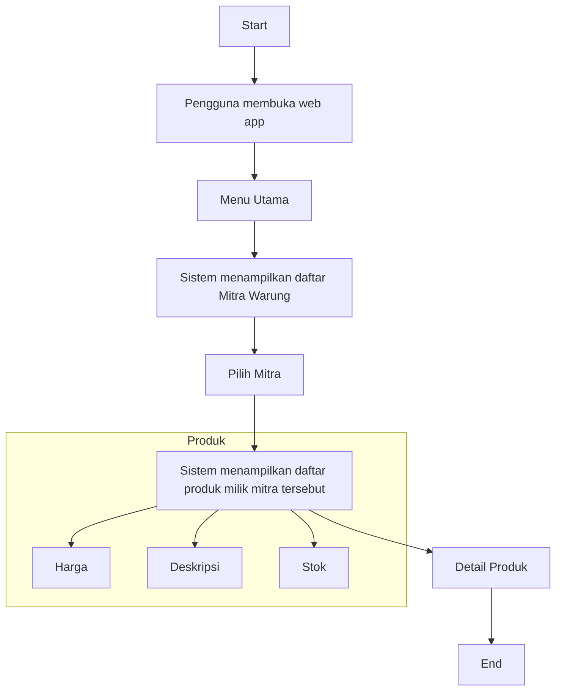

# Diagram Alur Kerja dan Use Case

## Alur Kerja Pengguna



## Use Case Diagram

```mermaid
usecaseDiagram
    actor Pengguna as Customer
    actor Admin as BuSoni

    Pengguna --> (Melihat daftar mitra)
    Pengguna --> (Mencari produk)
    Pengguna --> (Melihat detail produk dan harga)

    Admin --> (Mengelola data mitra)
    Admin --> (Mengelola data produk)

    note right of Admin
      Tambah/Edit/Hapus mitra
      Upload foto produk
      Update harga
    end note
```
